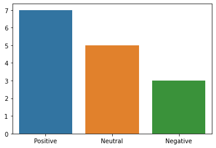
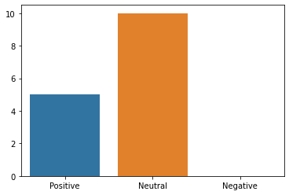
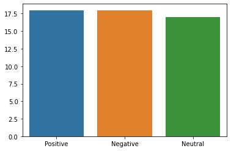

## Bussiness problem

When Apple and other tech companies release products such as the IPhone and IPad, it is important for their product development teams are aware of the public opinion. Understanding the public opinion is valuable because it can help these companies understand what the public thinks of certain features of their products or their entire product as a whole. Smartphones are a great example of when general public understanding is valuable because they are bought by the general public rather than a niche market. Sentiment Analysis is a great way to apply Machine Learning to this situation. In Sentiment Analysis a computer is able to classify text such as a comment, tweet, or customer review as having a positive, negative, or neutral sentiment towards the topic the text has been written about. For this project I used a dataset of 9,000 tweets mostly about iphones, ipads, and google.

## EDA Questions

1. according to the model how do the sentiment percentage breakdowns for ipad and iphone compare?

2. what are the top 5 most common words for tweets of negative, positive, and neutral sentiment?

3. how long is the average tweet of each sentiment?

4. what are the most used hashtags throughout the dataset?

## Findings

1. 

ipad...

iphone...
 

2.

3.

 

4.
