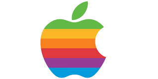
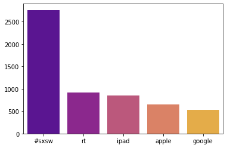
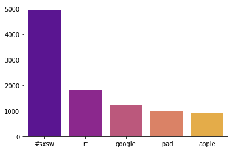
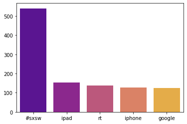
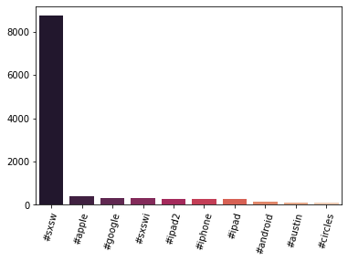
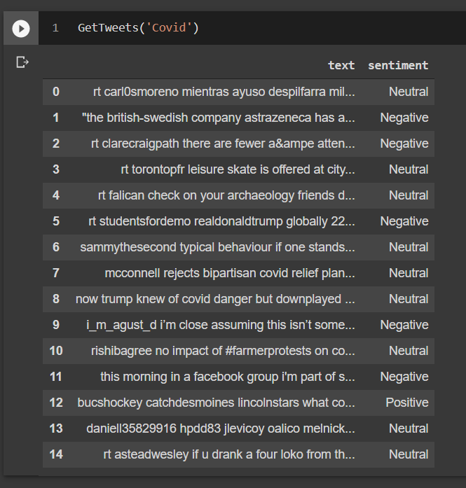

## Bussiness problem

When Apple and other tech companies release products such as the IPhone and IPad, it is important for their product development teams are aware of the public opinion. Understanding the public opinion is valuable because it can help these companies understand what the public thinks of certain features of their products or their entire product as a whole. Smartphones are a great example of when general public understanding is valuable because they are bought by the general public rather than a niche market. Sentiment Analysis is a great way to apply Machine Learning to this situation. In Sentiment Analysis a computer is able to classify text such as a comment, tweet, or customer review as having a positive, negative, or neutral sentiment towards the topic the text has been written about. For this project I used a dataset of 9,000 tweets mostly about iphones, ipads, and google.

## EDA Questions

1. according to the model how do the sentiment percentage breakdowns for ipad and iphone compare?

2. what are the top 5 most common words for tweets of negative, positive, and neutral sentiment?

3. how long is the average tweet of each sentiment?

4. what are the most used hashtags throughout the dataset?

## Findings

1. The iphone tweets were all labled as neutral or positive whereas some ipad tweets were labled as negative. This is likley due to the randomness of tweets provided by the tweepy module as each query only returns about 10 - 20 random tweets on a given topic. However as a user I have certainly had a better experiance with the iphone than the ipad.

ipad...

iphone...
 

2. #sxsw was a very popular term throughout the dataset, among them google, apple, and ipad were very popular words. #sxsw refers to the South By Southwest, an annual film festival hosted in Austin, TX. This is likley because these tweets may of been collected around the same time of year that the festival is held in mid-march.

positive sentiment...
 

neutral sentiment...
 

negative sentiment...
 

3. The Tweets remain about 18-20 characters long regardless of sentiment. Blindly looking at how long a tweet is would definatley be a good indicator of sentiment it takes a much closer analysis to properly classify these tweets.

 

4. '#sxsw' and it's variants; '#sxsw!', '#sxsw?', '#sxsw.', and '#sxsw:', was by far the most popular hashtag and it was used over 8,000 times throughout the dataset. most of the other hashtags refered to tech companies and tech products. '#austin' was also popular as the sxsw film festival is hosted in Austin, TX.

positive sentiment...
 

## Modeling

## Evaluation

 
